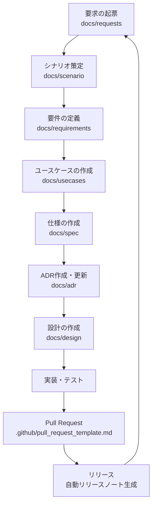

# ドキュメントテンプレート一覧

本リポジトリでは、個人開発における秩序だった開発を進めるために、要求定義からリリースまで一貫して管理するテンプレートを整備しています。

これらの雛形は、**必須ルール（要求→シナリオ→要件→ユースケース→仕様→設計→実装→テストの流れ、セキュリティ・可観測性・i18n/a11y・リリース管理など）に基づいて設計されています**。

必須ルールに沿ってドキュメントやタスクを作成することで、個人開発でも将来の拡張や保守が容易になります。

各ファイルは以下のパスに配置してください。

---

## ADR
- **パス**: `docs/adr/YYYYMMDD-title.md`
- **用途**: アーキテクチャや重要な意思決定を記録する
- **内容**: ステータス、日付、関連、コンテキスト、決定、根拠、セキュリティ、コスト、影響範囲

---

## 要求
- **パス**: `docs/requests/{title}.md`
- **用途**: アプリを通じて実現したい事項を 5W1H で記録
- **内容**: Who / What / Why / When / Where / How、受入基準

---

## シナリオ
- **パス**: `docs/scenario/{title}.md`
- **用途**: 要求に対して利用者が目的を達成する代表的な流れを記述
- **内容**: アクター、ゴール、フロー、受入基準

---

## 要件
- **パス**: `docs/requirements/{title}.md`
- **用途**: ユーザー種別・情報構造・提供機能・価値を整理。概念モデルを含む
- **内容**: ユーザー種別、情報構造、提供機能、得られる価値、セキュリティ、i18n・a11y、概念モデル（mermaid classDiagram）
- 
---

## ユースケース
- **パス**: `docs/usecases/{title}.md`
- **用途**: 要件をもとに機能ごとの利用手順を明確化
- **内容**: アクター、トリガー、前提条件、基本フロー、代替フロー、後提条件

---

## 仕様
- **パス**: `docs/spec/{title}.md`
- **用途**: ユースケースを基に具体的な機能を定義
- **内容**: 公開操作、入力要件、出力契約、制限事項、セキュリティ（構造化ログ等）、可観測性（相関ID・監査ログ）、i18n・a11y、仕様モデル（mermaid sequenceDiagram）

---

## 設計
- **パス**: `docs/design/{title}.md`
- **用途**: 仕様を満たすための実装指針を記述する
- **内容**: アーキテクチャ、データフロー、詳細設計、セキュリティ、可観測性、i18n・a11y

---

## PR テンプレート
- **パス**: `.github/pull_request_template.md`
- **用途**: PR 作成時に必須ルールを自己チェックする
- **内容**: ドキュメント、設計、セキュリティ、可観測性、テスト、インフラ、リリースに関するチェック項目

---

## 開発チェックリスト
- **パス**: `docs/checklists/dev-checklist.md`
- **用途**: 開発タスクごとに必須ルールを確認する
- **内容**: 要求〜設計、ADR記録、i18n/a11y、設計、セキュリティ、ログ、テスト、インフラ、リリース関連のチェックボックス

---

## Issue テンプレート

### 要求
- **パス**: `.github/ISSUE_TEMPLATE/request.yml`
- **用途**: 新しい要求を登録する
- **内容**: Who / What / Why / When / Where / How、受入基準

---

## 運用フロー（概要）

以下の流れに沿って、要求からリリースまで一貫して進めます。

このフローを繰り返すことで、ドキュメントと実装が常に同期し、後から参照しても一貫した履歴が追跡できます。

---

## 必須ルール一覧

必須ルールの詳細なチェック項目は [開発チェックリスト](./checklists/dev-checklist.md) を参照してください。

---

## テンプレート対応表

| 開発段階     | ドキュメント雛形                          | Issue テンプレート                         | PR チェック | セキュリティ | 可観測性 | i18n/a11y | リリース管理 |
|--------------|-------------------------------------------|--------------------------------------------|-------------|-------------|----------|-----------|--------------|
| 要求         | `docs/requests/{title}.md`                | `.github/ISSUE_TEMPLATE/request.yml`       |             |             |          |           |              |
| シナリオ     | `docs/scenario/{title}.md`                | —                                          |             |             |          |           |              |
| 要件         | `docs/requirements/{title}.md`            | —                                          |             |      ✅       | ✅        |    ✅       |              |
| ユースケース | `docs/usecases/{title}.md`                | —                                          |             |             |          |           |              |
| 仕様         | `docs/spec/{title}.md`                    | —                                          |             | ✅（ログ方針） | ✅（相関ID） |   ✅        |              |
| 設計         | `docs/design/{title}.md`                  | —                                          |             | ✅          | ✅        |     ✅      |              |
| ADR          | `docs/adr/YYYYMMDD-title.md`              | —                                          |             | ✅          | ✅        |           |              |
| チェックリスト | `docs/checklists/dev-checklist.md`      | —                                          | `.github/pull_request_template.md` | ✅ | ✅ | ✅ | ✅ |
| リリース     | —                                         | —                                          | `.github/pull_request_template.md` | ✅（リリースノート品質） |          |           | ✅（自動生成必須） |

---

## チェックリストの使い分け

- **`docs/checklists/dev-checklist.md`**
  - 開発全体のルールを体系的にまとめた「基準表」
  - 必須ルールの真実のソース（ソース・オブ・トゥルース）
  - 更新が必要になった場合は、まずここを修正する

- **Issue / PR テンプレートのチェックリスト**
  - 各タスクや PR ごとに「今回守ったか？」を確認するためのチェック欄
  - 作業履歴の中に「チェック済み」が残る
  - 実務向けのチェックシートとして使う

### 運用イメージ
1. **ルール更新** → `docs/checklists/dev-checklist.md` を修正する
2. **テンプレ参照** → 必要に応じて Issue / PR テンプレートに反映する
3. **作業実行** → 各 Issue / PR のチェック欄を埋める

👉 こうすることで、
- `docs/` 側が **ルールブック**
- Issue/PR 側が **現場のチェックシート**

という役割分担が明確になります。
